  <picture>
    <source media="(prefers-color-scheme: dark)" srcset="./dark.svg">
    <source media="(prefers-color-scheme: light)" srcset="./light.svg">
    
  </picture>

## 👋 About Me

Hi! I'm **Chaman Kumar**, a B.Tech CSE (AI & ML) student and aspiring **Software Engineer / Developer** with a strong interest in **Competitive Programming, Generative AI, and Agentic AI**.

* 🎓 **Education:** B.Tech CSE (AI & ML)
* 📍 **Location:** New Delhi
* 💻 **Interests:** Competitive Programming, Software Development & AI
* 🤖 **Currently exploring:** Generative AI & Agentic AI
* 🚀 **Goal:** Building impactful software and intelligent AI-powered solutions

I enjoy solving problems, learning new technologies, and turning ideas into practical projects.

## 🛠️ Tech Stack

### 💻 Languages

### 🌐 Web Development

### 🤖 AI

## 🚀 Featured Projects

### 🛒 E-Commerce Store

A full-stack e-commerce application focused on building a practical online shopping experience with modern web technologies.

**Tech:** React · Node.js · MySQL

[🔗 View Repository](https://github.com/psy-duckkk/ecommerce-store)

---

### 📚 Smart Library Management System

A library management project designed to simplify the management of books, users, and library operations.

**Tech:** Java · MySQL

[🔗 View Repository](https://github.com/psy-duckkk/Smart-Library-Management-System)

## 🎯 Current Focus

* 🤖 Exploring **Generative AI** and **Agentic AI**
* 🧠 Learning how to build AI-powered applications and intelligent agents
* 💻 Strengthening my skills in **Software Development** and **Competitive Programming**
* 🚀 Building projects that combine **AI with practical software solutions**
* 📚 Continuously learning and experimenting with new technologies

## 📊 GitHub Stats

  
  

## 🤝 Connect With Me

  
  
  

  <i>Let's build something amazing together! 🚀</i>

